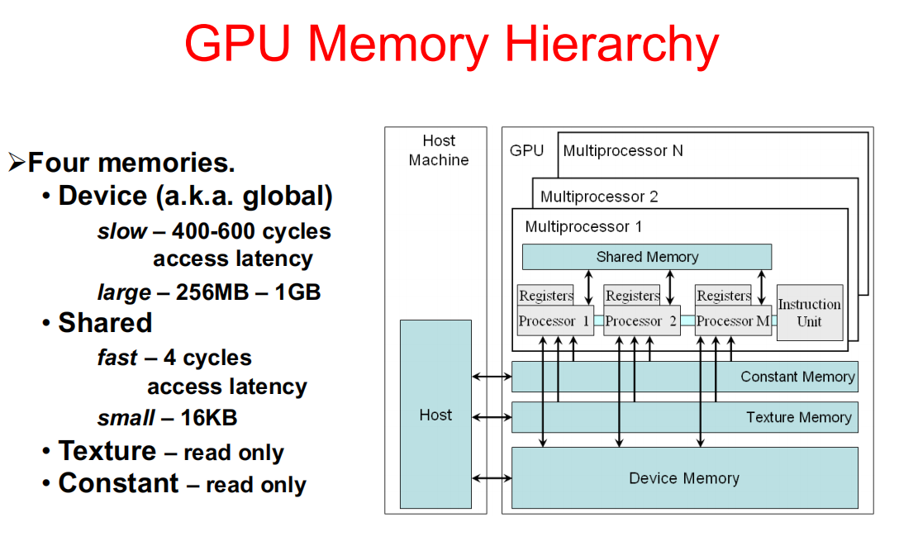
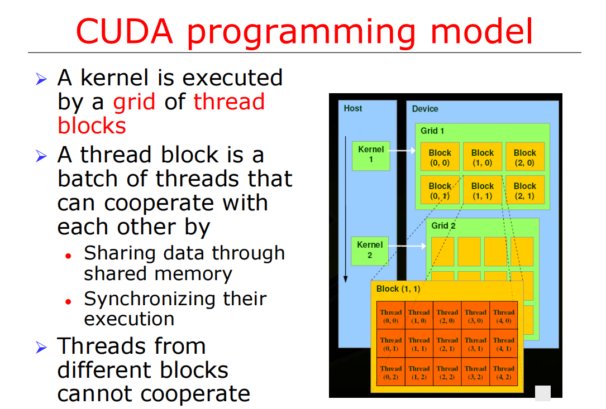
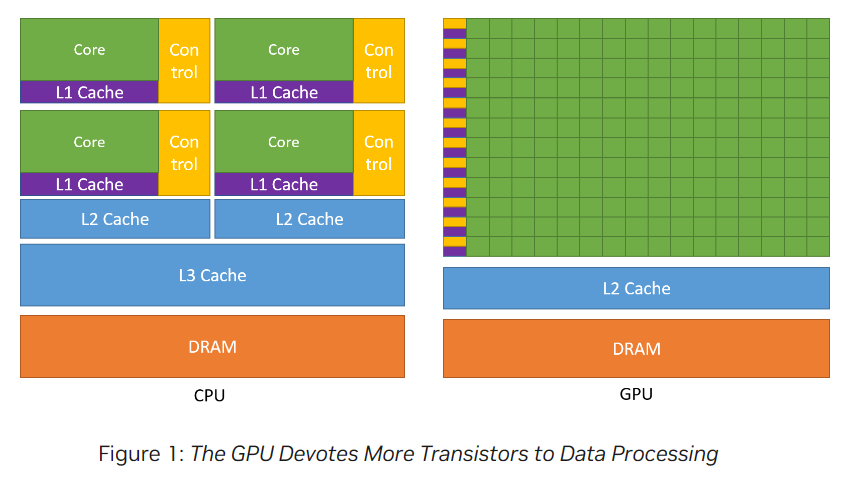
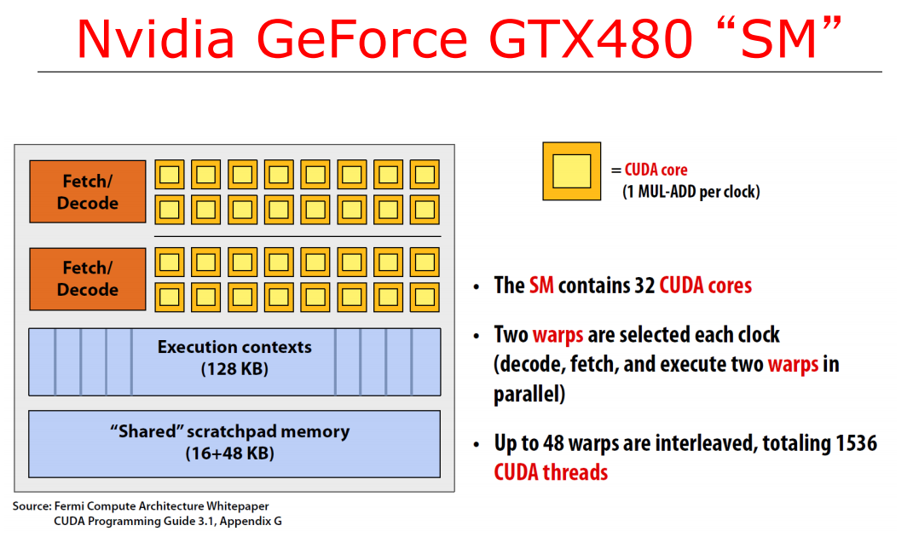

## Graphics Processing Unit

The relationship between GPGPU and CUDA is that CUDA is one of the leading technologies that enable GPGPU. It provides the tools and frameworks necessary to harness the power of the GPU beyond graphics. CUDA includes a runtime environment, a programming language (an extension of C/C++), libraries, and development tools designed specifically for GPGPU tasks.

> Modern GPUs can indeed interleave the execution of multiple threads. This is typically done in groups of threads known as warps (in NVIDIA's terminology) or wavefronts (in AMD's terminology). A warp or wavefront is a set of threads that execute the same instruction at the same time on different data.

**Attention:** In a GPU, the SIMD model is more accurately described as SIMT (Single Instruction, Multiple Threads), where each thread in a warp executes the same instruction on its own data element, and the collection of threads within a warp operates in a SIMD fashion. The vector registers in a GPU are used by individual threads to hold their own data; they're not shared across threads in the traditional sense of vector processing found in CPUs.

> In the context of NVIDIA's CUDA programming model, one multi-processor on a GPU is typically considered as one SIMT (Single Instruction, Multiple Thread) unit.

The block structure allows a CUDA program to scale efficiently across multiple processors. This means that as you add more processing power (more multi-processors on the GPU), the program can automatically take advantage of the additional resources because blocks can be distributed across all available multi-processors.

> A Streaming Multiprocessor (SM) in a GPU is a fundamental processing unit responsible for executing parallel threads, consisting of CUDA cores, shared memory, registers, and control logic.

The NVIDIA GeForce GTX 480 has 15 Streaming Multiprocessors (SM). Each Streaming Multiprocessor (SM) in the NVIDIA GeForce GTX 480 has 32 CUDA cores. There would also be 32 ALUs per SM, as each CUDA core contains an ALU.

